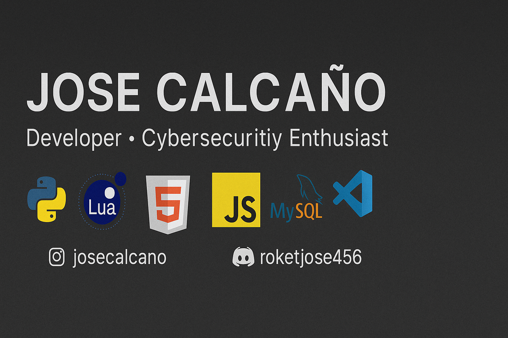

<!-- PERFIL DE GITHUB – JOSE CALCAÑO (ALKA-DOM) -->

<!-- Banner -->

# 🧠 JOSE CALCAÑO
### 💻 Developer • Cybersecurity Enthusiast • FiveM Scripter

> Tecnología con enfoque, código con intención.

💻 Soy Jose Calcaño, conocido como ALKAEDA, un desarrollador apasionado por la programación, la ciberseguridad y el desarrollo de soluciones inteligentes.

Mi filosofía es clara: el código no solo debe funcionar, debe inspirar. Cada línea que escribo busca ser una mezcla entre precisión técnica y creatividad, combinando lógica, rendimiento y diseño limpio.

Desde mis inicios he trabajado en proyectos que abarcan desde scripts personalizados para servidores FiveM, hasta automatización con Python y sistemas web estructurados con integraciones seguras y eficientes. Me gusta diseñar entornos donde la funcionalidad y la estética convivan sin comprometer la estabilidad.

Me motiva el desafío constante de aprender, romper límites y crear herramientas que dejen una huella en la comunidad de desarrolladores. La programación para mí no es solo trabajo: es una forma de vida, una manera de entender cómo se construye y se protege el mundo digital.

🔒 En un entorno donde la seguridad y la innovación van de la mano, me enfoco en construir código robusto, modular y pensado para evolucionar.

⚡ "No solo escribo código. Construyo ideas que permanecen." 

---

## 🧩 Tech Stack
**Lenguajes:** `Python` · `Lua` · `JavaScript` · `HTML` · `MySQL`  
**Fuertes:** Integración de APIs · Diseño de BD · Automatización · Depuración · Optimización de rendimiento  
**Herramientas:** `Git` · `VSCode` · `Node.js` · `XAMPP` · `FiveM Natives`

---

## 📊 Activity & Stats

---

## 🚀 Proyectos Destacados
- 🔧 **FiveM – ESX/OX Scripts**  
  Utilidades y sistemas personalizados para servidores (inventario, llaves, notificaciones, economía).
- 🐍 **Python Automation**  
  Bots/CLI para scraping, tareas repetitivas y pipelines simples.
- 🌐 **Frontend rápido**  
  Sitios estáticos y UIs ligeras con HTML/JS limpios.

